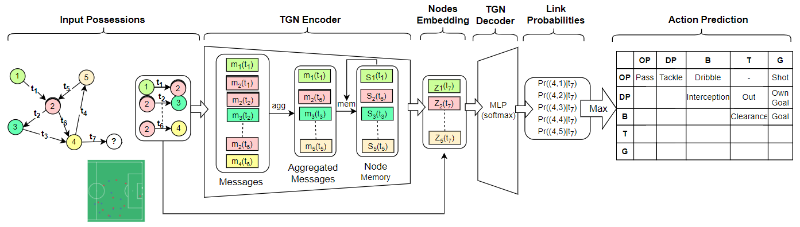

# Soccer Network
Soccer Network is special type of temporal graph network, receiving tracking data in form of a graph and predicting the most probable offensive or defensive actions. 



## Data syncronization method:

    For the data syncronization we first needed to flatten out the raw datafiles. The event data proved to be tricky, since there are different numbers of qualifiers for different types of events. To tackle this, we used the flatten_json library, that sort of dummifies the json file and flattens it out completely.
    Some events were thrown out. The ones kept have the following type ids: 1, 2, 3, 7, 8, 10, 11, 12, 13, 14, 15, 16, 41, 50, 52, 58, 61, 74.

    To be able to evaluate the syncing and later feature generation we needed to sync the players', who commited an event/action, tracking id. We got this with the help of the '2021-08-19-jpl-season-2020-2021-squads.csv' file.

    We then generated some features, like time left in the half, distance to goal and so on.

    Next we had to convert the iso8601 timestamps of the event data to time epochs. We assumed the tracking data and the kick-off event were at the same time. In reality the timestamps were not exactly the same, so we calculated the offset between the two and shifted the event timestamps accordingly. We did this for the two halves independently. 

    Another important step of preparing the syncing method, was converting the coordinates of the event and tracking data. We converted both to an absolute coordinate system, where the (0;0) point is in the bottom left corner of the pitch, and the length and width of the pitch are 105 and 68 meters. The tracking area is wider (and longer) than the pitch,, so there can be values that fall outside of the said range of values.

    For the syncing method itself, we tried two: One, where we only account for the timestamps and another, where we look at the position of the ball and the player, who commited the action/event. There were some issues with the later, where a bigger number of events would be 'paired up' with the same tracking data record, resulting in high error rates. Due to lack of time to investigate this issue, we went with the first approach. Some outliners still remained, but for the same reason as before, we got rid of them for now.
    
## Running the script

### Creating data structure
First we need to create the raw data structure that the scripts imported from the TGN repository can use. ./datasync_balu/createNF.py does just that, however the *path* variable in line 736 needs to be changed in the script for it to run well.
The value should be:
```

path = <absolute path of the folder containing the raw tracking- and event data files>
```
The folder also needs to contain the *2021-10-21-stats-perform-data-availability (3).csv* file.

Another change that could be made is to the name of the output csv. It can be done at the end of the script.

The sricpt runs with the following command:
```

python datasync_balu/createNF.py
```

### TGN preproccessing
Before running the preproccessing script, the output file of createNF.py needs to be moved/copied to `./data`
```

python utils/preprocess_data.py --data <name of the output file of createNF.py>
```

### TGN training

```

python link_prediction.py --data <name of the output file of createNF.py> --use_memory --memory_dim <number of node features> --aggregator mean
```
For now, the number of node features are 9.

